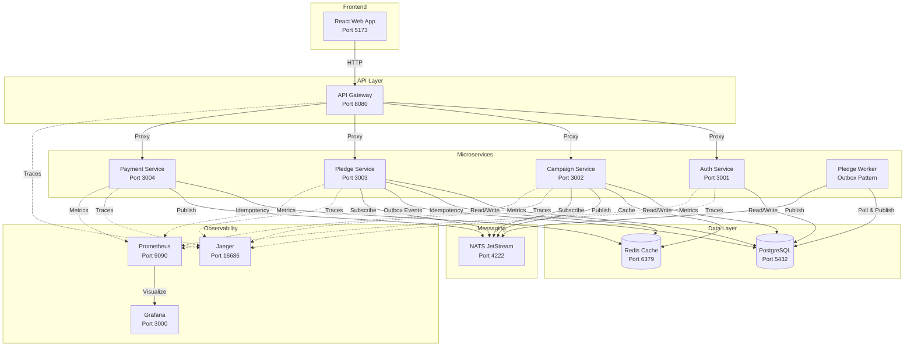

# CareForAll - Microservices Hackathon Solution

## Architecture Overview



## Key Design Patterns

### 🔄 Transactional Outbox Pattern
- Pledge Service writes events to outbox table in same transaction as pledge
- Separate worker polls outbox and publishes to NATS
- Guarantees at-least-once delivery without distributed transactions

### 🎯 State Machine
- Pledge status transitions: `PENDING → AUTHORIZED → CAPTURED` or `FAILED`
- Prevents invalid state transitions (e.g., CAPTURED → AUTHORIZED)
- Handles out-of-order webhook delivery

### 🔑 Idempotency
- Payment webhooks use Redis to detect duplicate events
- Pledge creation supports `x-idempotency-key` header
- Prevents double-charging users

### 📊 CQRS (Command Query Responsibility Segregation)
- Campaign Service uses Redis for read-optimized queries
- Write operations invalidate cache and publish events
- Separates read and write concerns for scalability

## Architecture
- **Runtime**: Bun
- **Framework**: Hono
- **Database**: PostgreSQL + Drizzle ORM
- **Messaging**: NATS
- **Caching**: Redis
- **Frontend**: React + Vite
- **Observability**: OpenTelemetry + Jaeger + Prometheus + Grafana

## Prerequisites
- Docker & Docker Compose
- Bun (optional, for local dev)

## Running the System

1. **Start Infrastructure & Services**:
   ```bash
   docker-compose up --build
   ```

2. **Initialize Database** (first time only):
   ```bash
   # Generate migration files
   bun run db:generate
   
   # Apply migrations to database
   bun run db:push
   ```

3. **Access Points**:
   - **Frontend**: http://localhost:5173 (Run locally with `cd apps/web && bun dev` for now, or add to docker)
   - **API Gateway**: http://localhost:8080
   - **Jaeger UI** (Tracing): http://localhost:16686
   - **Grafana** (Metrics): http://localhost:3000 (admin/admin)
   - **Prometheus**: http://localhost:9090
   - **Kibana** (Logs): http://localhost:5601
   - **Elasticsearch**: http://localhost:9200

## Services
- **Auth**: User management & JWT.
- **Campaign**: Campaign CRUD & Read Models.
- **Pledge**: Donation processing with State Machine & Outbox.
- **Payment**: Mock payment provider & Idempotent Webhooks.
- **Gateway**: API Gateway.

## Development
- Run `bun install` to install dependencies.
- Run `bun run dev` in specific app folders.
