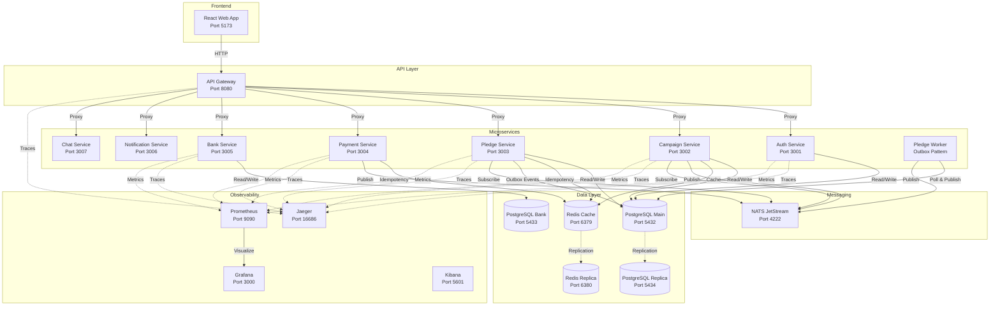

# CareForAll - Microservices Hackathon Solution

## ✅ Checkpoint 1: Architecture & Design Strategy

We have successfully mapped out the **CareForAll** ecosystem with a fault-tolerant, scalable microservices architecture.

### 🏗️ Architecture Highlights
- **Microservices Boundaries**: Distinct services for Auth, Campaign, Pledge, Payment, and Banking, ensuring separation of concerns.
- **Fault Tolerance**: Implemented **Idempotency** (Redis), **Outbox Pattern** (Reliable Events), and **Circuit Breakers**.
- **Scalability Strategy**:
  - **Horizontal Scaling**: Our stateless services (Campaign, Pledge) are designed to be scaled horizontally.
  - **Database Replication**: We use a **Read Replica** (`postgres-replica`) to offload read traffic from the main database.
  - **Cache Replication**: We use a **Redis Replica** (`redis-replica`) for high-availability caching.
  - **Demonstration**: You can scale any service using Docker Compose:
    ```bash
    docker compose up -d --scale campaign=3 --scale pledge=2
    ```
- **Data Models**: Defined using **Drizzle ORM** in `packages/db`, ensuring type safety and clear schema definitions.
- **Diagram**: See the [Architecture Overview](#architecture-overview) below for a visual representation.

---

## Architecture Overview



## Service Registry

| Service | Port | Description |
|---------|------|-------------|
| **Frontend** | `5173` | React Web Application |
| **API Gateway** | `8080` | Unified entry point for all APIs |
| **Auth Service** | `3001` | Authentication & Authorization |
| **Campaign Service** | `3002` | Campaign management & public listing |
| **Pledge Service** | `3003` | Donation processing & state machine |
| **Payment Service** | `3004` | Payment gateway integration |
| **Bank Service** | `3005` | Simulated banking system (Isolated DB) |
| **Notification Service** | `3006` | Real-time WebSocket notifications |
| **Chat Service** | `3007` | Real-time WebSocket chat rooms |

## Infrastructure Components

| Component | Port | Description |
|-----------|------|-------------|
| **PostgreSQL (Main)** | `5432` | Primary database for core services |
| **PostgreSQL (Bank)** | `5433` | Dedicated database for Bank Service |
| **PostgreSQL (Replica)** | `5434` | Read replica for Main DB |
| **Redis (Primary)** | `6379` | Cache & Pub/Sub |
| **Redis (Replica)** | `6380` | Read replica for Redis |
| **NATS** | `4222` | Message Broker (JetStream enabled) |
| **Jaeger** | `16686` | Distributed Tracing UI |
| **Prometheus** | `9090` | Metrics Collection |
| **Grafana** | `3000` | Metrics Visualization |
| **Kibana** | `5601` | Log Analysis |

## Key Design Patterns

### 🔄 Transactional Outbox Pattern
- Pledge Service writes events to outbox table in same transaction as pledge
- Separate worker polls outbox and publishes to NATS
- Guarantees at-least-once delivery without distributed transactions

### 🎯 State Machine
- Pledge status transitions: `PENDING → AUTHORIZED → CAPTURED` or `FAILED`
- Prevents invalid state transitions (e.g., CAPTURED → AUTHORIZED)
- Handles out-of-order webhook delivery

### 🔑 Idempotency
- Payment webhooks use Redis to detect duplicate events
- Pledge creation supports `x-idempotency-key` header
- Prevents double-charging users

### 📊 CQRS (Command Query Responsibility Segregation)
- Campaign Service uses Redis for read-optimized queries
- Write operations invalidate cache and publish events
- Separates read and write concerns for scalability

## Architecture
- **Runtime**: Bun
- **Framework**: Hono
- **Database**: PostgreSQL + Drizzle ORM
- **Messaging**: NATS
- **Caching**: Redis
- **Frontend**: React + Vite
- **Observability**: OpenTelemetry + Jaeger + Prometheus + Grafana

## Prerequisites
- Docker & Docker Compose
- Bun (optional, for local dev)

## Running the System

1. **Start Infrastructure & Services**:
   ```bash
   docker-compose up --build
   ```

2. **Initialize Database** (first time only):
   ```bash
   # Generate migration files
   bun run db:generate
   
   # Apply migrations to database
   bun run db:push
   ```

3. **Access Points**:
   - **Frontend**: http://localhost:5173 (Run locally with `cd apps/web && bun dev` for now, or add to docker)
   - **API Gateway**: http://localhost:8080
   - **Jaeger UI** (Tracing): http://localhost:16686
   - **Grafana** (Metrics): http://localhost:3000 (admin/admin)
   - **Prometheus**: http://localhost:9090
   - **Kibana** (Logs): http://localhost:5601
   - **Elasticsearch**: http://localhost:9200

## Services
- **Auth**: User management & JWT.
- **Campaign**: Campaign CRUD & Read Models.
- **Pledge**: Donation processing with State Machine & Outbox.
- **Payment**: Mock payment provider & Idempotent Webhooks.
- **Gateway**: API Gateway.

## Development
- Run `bun install` to install dependencies.
- Run `bun run dev` in specific app folders.

## 📚 Documentation

- **[Quick Start Guide](./QUICKSTART.md)** - Setup and testing instructions for judges
- **[Credentials & Access](./CREDENTIALS.md)** - 🔑 All login credentials, database access, and service URLs
- **[Security Documentation](./SECURITY.md)** - Authentication, authorization, and security best practices
- **[Progress Tracker](./HACKATHON_FIXES.md)** - Implementation status and checklist
- **[Test Results](./TEST_RESULTS.md)** - Latest system test results
- **[Test Script](./test-all-services.sh)** - Comprehensive automated testing
- **[Environment Variables](./.env.example)** - Configuration template

## 🎁 Bonus Features

We have gone above and beyond to implement real-time features using WebSockets:

### 🔔 Notification Service (Port 3006)
- **Real-time Updates**: Broadcasts system events (Campaign Created, Pledge Made, Payment Succeeded) to connected clients.
- **Tech Stack**: Hono, Bun, NATS (Sub), WebSockets.
- **Integration**: Subscribes to NATS subjects and pushes updates to the frontend.

### 💬 Chat Service (Port 3007)
- **Real-time Chat**: Allows users to join rooms and chat in real-time.
- **Tech Stack**: Hono, Bun, WebSockets.
- **Features**: Room management, user presence, message broadcasting.

### 🐳 Dockerized Everything
- All services, including the new Notification and Chat services, are fully containerized and orchestrated via `docker-compose`.

## 🔒 Security Features

### Authentication & Authorization
- **JWT-based authentication** with 24-hour token expiry
- **Role-based access control (RBAC)** for admin operations
- **Password hashing** with bcrypt (10 rounds)
- **Protected endpoints** require valid JWT tokens

### Data Protection
- **Idempotency protection** prevents duplicate charges
- **State machine validation** prevents invalid transitions
- **Input validation** with Zod schemas on all endpoints
- **SQL injection protection** via Drizzle ORM

### Security Monitoring
- **Structured logging** of authentication events
- **Health checks** verify all service dependencies
- **Environment validation** at startup
- **CORS configuration** restricts origins

See [SECURITY.md](./SECURITY.md) for comprehensive security documentation.

## 🧪 Testing

Run the complete test suite:
```bash
bun test
```

Run specific tests:
```bash
bun test packages/common/test/state-machine.test.ts
bun test apps/payment/test/idempotency.test.ts
```

Run system integration test:
```bash
./test-system.sh
```

## 📊 Monitoring & Observability

### Traces (Jaeger)
View end-to-end request traces at http://localhost:16686
- Select service to trace
- View distributed spans across microservices
- Analyze latency bottlenecks

### Metrics (Prometheus + Grafana)
- **Prometheus**: http://localhost:9090 - Query metrics directly
- **Grafana**: http://localhost:3000 - Visualize metrics (admin/admin)
- All services expose `/metrics` endpoints

### Logs (Elasticsearch + Kibana)
- **Kibana**: http://localhost:5601 - Search and analyze logs
- **Elasticsearch**: http://localhost:9200 - Log storage
- Structured JSON logging across all services

## 🏗️ Project Structure

```
api-avengers/
├── apps/
│   ├── auth/          # Authentication service (JWT)
│   ├── campaign/      # Campaign management + CQRS
│   ├── pledge/        # Pledge processing + Outbox pattern
│   ├── payment/       # Payment provider simulation
│   ├── gateway/       # API Gateway + routing
│   └── web/           # React frontend + Admin panel
├── packages/
│   ├── common/        # Shared utilities (logger, middleware, state machine)
│   ├── db/            # Database schema + Drizzle ORM
│   ├── events/        # NATS client wrapper
│   └── telemetry/     # OpenTelemetry configuration
├── infra/
│   └── prometheus/    # Prometheus configuration
├── .github/
│   └── workflows/     # CI/CD pipeline
└── docker-compose.yml # Full stack orchestration
```

## 🚀 CI/CD Pipeline

GitHub Actions workflow provides:
- ✅ Automated testing on PR
- ✅ Type checking and linting
- ✅ Smart service detection (only builds changed services)
- ✅ Docker image building with semantic versioning
- ✅ Integration tests with real services

## 🎯 Key Features Demonstrated

### 1. Transactional Outbox Pattern
Ensures reliable event publishing without distributed transactions.

### 2. State Machine
Prevents invalid pledge state transitions with proper validation.

### 3. Idempotency
Protects against duplicate payments via Redis-backed idempotency keys.

### 4. CQRS
Campaign service separates reads (Redis cache) from writes (PostgreSQL).

### 5. Event-Driven Architecture
Services communicate via NATS for loose coupling.

### 6. Observability
Full tracing, metrics, and logging infrastructure.

## 🔒 Security Considerations

- JWT-based authentication (Auth service)
- Idempotency keys prevent duplicate charges
- State machine prevents backward transitions
- Environment variables for secrets (see .env.example)

## 📈 Scalability

Scale services independently:
```bash
docker-compose up -d --scale pledge=3 --scale campaign=2
```

Features supporting high load:
- Redis caching for read-heavy operations
- Outbox pattern with concurrent workers
- NATS for async communication
- Database connection pooling

## 👥 Team

Built for the API Avengers Microservices Hackathon.

## 📝 License

MIT
